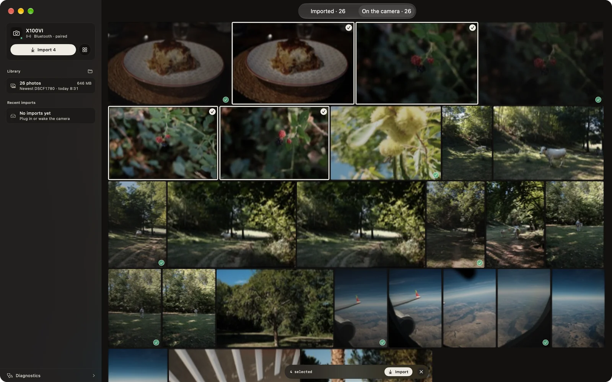
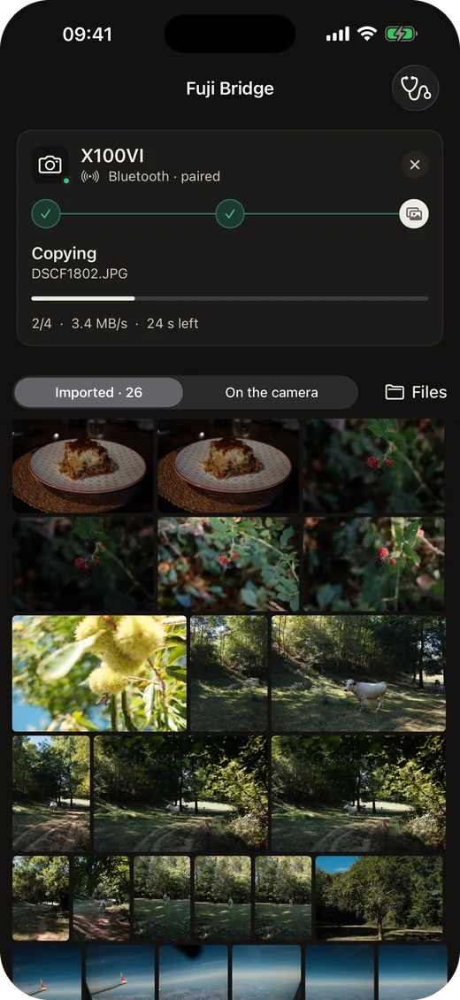
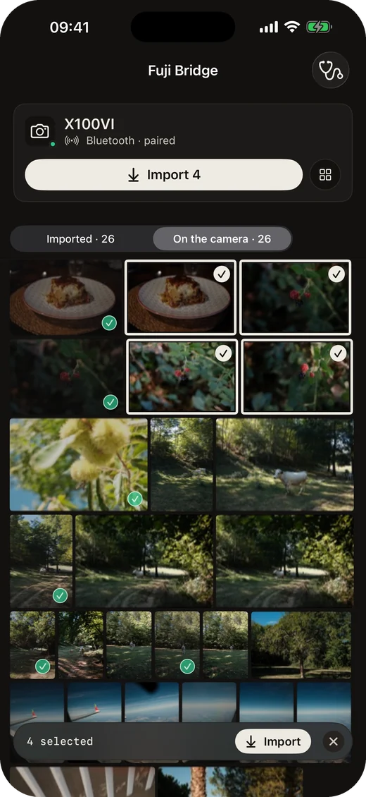
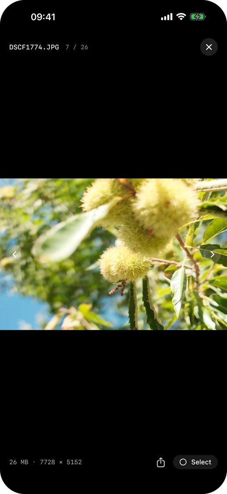

<p align="center">
  
</p>

<h1 align="center">Fuji Bridge</h1>

<p align="center">
  Photos from your Fujifilm to your iPhone, iPad and Mac.<br>
  Over USB or Wi-Fi, with the camera woken over Bluetooth.
</p>

<p align="center">
  <a href="https://apps.apple.com/app/id6816612097"><b>App Store</b></a> · €4.99
</p>

<br>

<p align="center">
  
</p>

<p align="center">
  
  &nbsp;
  
  &nbsp;
  
</p>

<br>

I love my Fujifilm X100VI. I didn't love the app that comes with it: imports stuck on a spinner, a Wi-Fi link that drops without saying why, and no way to know what went wrong. So I made my own.

It copies over the cable or over Wi-Fi, lets me look at the card before copying anything, and when a transfer is slow, it tells me why. I use it with the X100VI; other recent Fujifilm bodies should work too.

**Private.** No account, no analytics, no server. The app talks to your camera and nothing else. Photos stay in Files › Fuji Bridge, or Pictures › Fuji Bridge on the Mac.

**Open source.** Buying it on the App Store is how you can support me. If you'd rather not, that's fine: build it yourself, it's the same app:

```sh
brew install xcodegen
xcodegen generate
open FujiBridge.xcodeproj   # set your team, then Run
```

Notes on the protocol, the tests and the camera's quirks: [docs/DEVELOPMENT.md](docs/DEVELOPMENT.md). Store assets: [docs/STORE.md](docs/STORE.md).

<sub>MIT licensed. Not affiliated with FUJIFILM Corporation.</sub>
